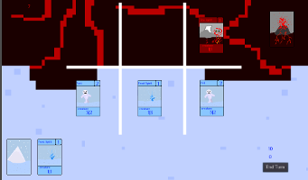

### Hello!

I enjoy making video games, and have been doing so for several years. Recently I have been using Godot, but have previously used Gamemaker and [Construct 2.](https://www.construct.net/en/tutorials/beginners-guide-construct-47) All these games were done in [Godot](https://docs.godotengine.org/en/stable/index.html), and all the art was done in [Piskel](https://www.piskelapp.com). Sometimes I participate in Game Jams, where you spend some number of days making a game from start to finish, usually with a theme, which can be almost anything. All of the games here need a keyboard and mouse to play.

#### Archea

[Archea][Archea] is the one I have spent the most time on, and I think it is the best game I've made to date. It was inspired by Dead Cells, which is a platformer where you run through levels and fight bad guys and collect treasure (like most games). There are still some bugs to work out here, but they shouldn't be a problem if you want to play.  

#### Frost

Frost is the second-best one in my opinion. I made it over five long days for a game jam. This particular jam was sponsored by Epic Games, and in order to submit the game you had to make it in Unreal Engine, a tool I don't know. I made this game in Godot, because I know it much better, but wasn't able to submit the game officially. The theme for the game jam was "_What is hidden in snow comes forth in the thaw_", so I did the obvious thing and made a deckbuilding game with fire and ice monsters fighting each other. My younger brother helped me with a lot of the art. Link coming soon.  

#### Kite Man

And then there's [Kite Man][Kite Man]. Made for Ludem Dare 46, themed Keep it Alive, over the course of one day. The game jam was a two-day thing, but my first idea didn't work out, so I was left with the second day to make something. The running guy was inspired by the little red character from Mevo and the Grooveriders. Note: this is not an accurate representation of how to fly a kite.  

#### Fam Jams

Once a month my famliy gets together and spends a saturday making a video game. One of my younger brothers is the creative director and tells us what to make. Then, we all make something together. All our Fam Jam games are [here][Fam Jam].

[Archea]: https://the-alex-g.github.io/Archea
[Frost]: https://the-alex-g.github.io/Frost
[Kite Man]: https://the-alex-g.github.io/LD46
[Fam Jam]: https://the-g-force.github.io
