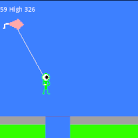

### Hello!

I am a fairly average person who happens to enjoy making video games. Recently I have been using Godot, but have previously used Gamemaker and Construct 2. All these games were done in Godot, and all the art was done in Piskel.

#### [Archea][Archea]

Archea is the one I have spent the most time on, and I think it is the best game I've made to date. It was inspired by Dead Cells, which is a platformer where you run through levels and fight bad guys and collect treasure (like most games).  

#### [Frost][Frost]

Frost is the second-best one in my opinion. I made it over five long days, technechally for a game jam, but the game jam was for Unreal Engine, which I don't know. So, I used Godot and didn't submit this game. The theme for the game jam was something like "**_What is hidden in snow comes forth in the thaw_**", so I did the obvious thing and made a deckbuilding game with fire and ice monsters fighting each other. My younger brother helped me with a lot of the art.

#### [Kite Man][Kite Man]

And then there's Kite Man. Made for Ludem Dare 46, themed Keep it Alive, over the course of one day. The game jam was a two-day thing, but my first idea didn't work out, so I was left with the second day to make something.  

#### Fam Jams

Once a month my famliy gets together and spends a saturday making a video game. One of my younger brothers is "in charge" and tells us what to make. Then, the we all make something together. All our Fam Jam games are [here][Fam Jam].

[Archea]: https://the-alex-g.github.io/Archea
[Frost]: https://the-alex-g.github.io/Frost
[Kite Man]: https://the-alex-g.github.io/LD46
[Fam Jam]: https://the-g-force.github.io
