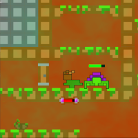
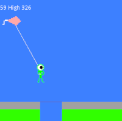

## Hello!

I enjoy making video games, and have been doing so for several years. Recently I have been using Godot, but have previously used Gamemaker and [Construct 2.](https://www.construct.net/en/tutorials/beginners-guide-construct-47) Unless otherwise specified, these games were made in [Godot](https://docs.godotengine.org/en/stable/index.html), and all the art was done in [Piskel](https://www.piskelapp.com). Sometimes I participate in Game Jams, where you spend some number of days making a game from start to finish, usually with a theme, which can be almost anything. All of the games here need a keyboard and mouse to play.

### Archea

[Archea](https://the-alex-g.github.io/Archea) is one of the first serious games I made in godot. It was inspired by Dead Cells, which is a platformer where you run through levels and fight bad guys and collect treasure (like most games).  

### Frost

I made this game over five long days for a game jam. This particular jam was sponsored by Epic Games, and in order to submit the game you had to make it in Unreal Engine, a tool I don't know. I made this game in Godot, because I know it much better, but wasn't able to submit the game officially. The theme for the game jam was "_What is hidden in snow comes forth in the thaw_", so I did the obvious thing and made a deckbuilding game with fire and ice monsters fighting each other. Leo helped me with a lot of the art. Link coming soon (or not).  

### Kite Man

And then there's [Kite Man](https://the-alex-g.github.io/LD46). Made for Ludum Dare 46, themed Keep it Alive, over the course of one day. The game jam was over a two-day period, but my first idea didn't work out, so I was left with the second day to make something. The running guy was inspired by the little red character from Mevo and the Grooveriders. Note: this is not an accurate representation of how to fly a kite.  

### Torus

I made [Torus](https://the-alex-g.github.io/LD47) for Ludum Dare 47. The theme was Stuck in a Loop, and I wanted to make a three-demensional game. I had to make this in one day, because Peter's birthday was tomorrow. Still, I think it turned out pretty well.  

### Fathom

I made [Fathom](https://the-alex-g.github.io/7DRL_2021) for the seven-day roguelike challenge (7DRL) where you have to make a complete roguelike in seven days. It wasn't quite as hard as I expected, but it definitely helped that I made most of my assets the week before.  

### Goblin Mining

Sometime near the start of the month of November, I started attending [Phyxtgears](https://phyxtgears.org) meetings. Phyxtgears is the local robotics team. They use C++ to program the robot, and I did not know any of that language. Since it was November, and was having trouble with National Game Design Month, I decided to make a game in C++ and count it as my NaGaDeMon project. I made a Minesweeper-like where you are a yellow "p" trying to avoid orange ogres and find green goblins. Dad and I worked together to try and put this game online, but we failed. We were able to create a linux executable, however, which can be found on the game's [github page](https://github.com/the-alex-g/NaGaDeMon2021-2).

### Fam Jams

Once a month my family gets together and spends a saturday making a video game. One of my younger brothers is the creative director and tells us what to make. Then, we all make something together. All our Fam Jam games are [here](https://the-g-force.github.io).

[Frost]: https://the-alex-g.github.io/Frost
